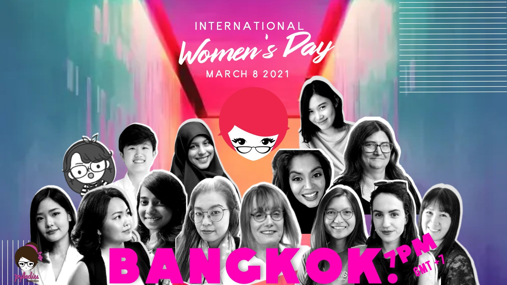
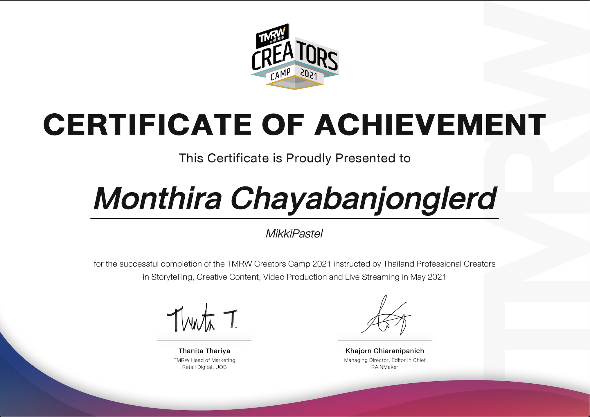
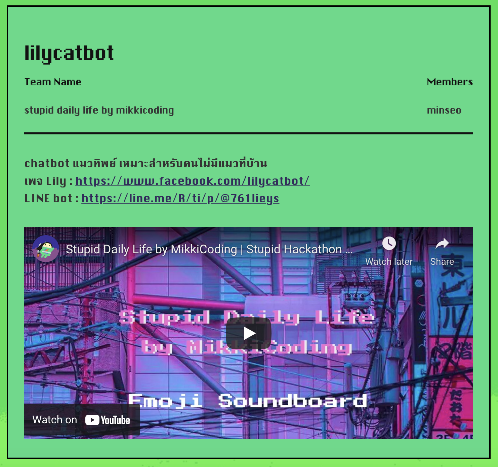
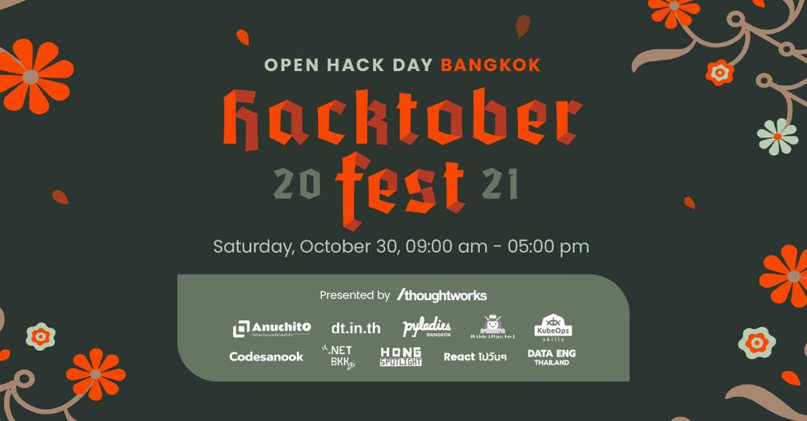
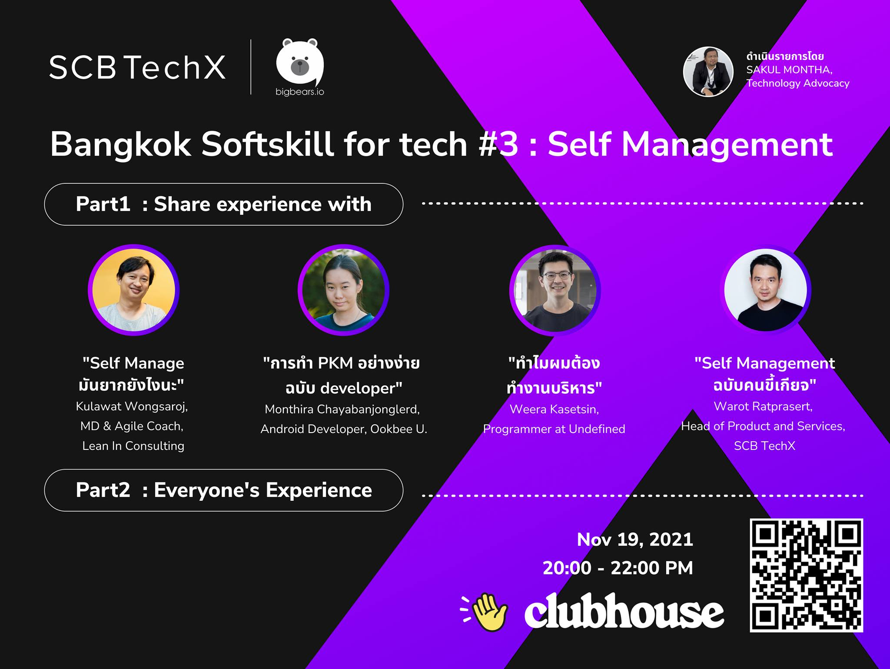

# 🗓 2021

📊 **Stat**
- 73 blogs
- 2 public speakers

---

## January

#### 📖 Blog
- [ทำ caching data ในแอพของเราผ่าน Room กันเถอะ](https://www.mikkipastel.com/caching-data-in-app-with-room/)
- [เรียน JavaScript for Beginner กับคอร์สในชุด Crash Course Series](https://www.mikkipastel.com/javascript-for-beginner-crash-course-series/)
- [จดบันทึกงาน ThoughtWorks Talks Tech Webinar เรื่อง Democratizing Programming](https://www.mikkipastel.com/thoughtworks-talks-tech-webinar-democratizing-programming/)
- [ชาว Android Kotlin Developer มาใช้ View Binding กันเถอะ](https://www.mikkipastel.com/view-binding-for-android-kotlin-developer/)

## February

#### 📖 Blog
- [จดสรุปการเรียน Agile Foundation ในเว็บ klasssi](https://www.mikkipastel.com/agile-foundation-klassi/)
- [จดบันทึก knowledge sharing เรื่องของ agile & scrum](https://www.mikkipastel.com/ookbee-knowledge-sharing-agile-and-scrum/)
- [สรุป best practices สำหรับ modularized app ที่มี dynamic features จากทาง LINE กันเถอะ](https://www.mikkipastel.com/line-developer-day-2020-best-practices-for-a-modularized-app-with-dynamic/)
- [เรียน Node.js Crash Course แบบฟรีๆ เพื่อความเข้าใจที่มากขึ้น](https://www.mikkipastel.com/node-js-crash-course/)

## March

#### 📖 Blog
- [[Review] ซื้อปากกา LAMY เป็นของขวัญให้ตัวเอง เพื่อใช้ในการจดบันทึกต่างๆ](https://www.mikkipastel.com/review-lamy-safari-special-edition/)
- [เข้าใจการทำหลังบ้านกับคอร์ส Express.js Crash Course](https://www.mikkipastel.com/express-js-crash-course/)
- [สรุป Clubhouse "การเรียนรู้อย่างทรงพลังด้วย Retrieval Practice"](https://www.mikkipastel.com/summary-clubhouse-retrieval-practice/)
- [[Review] เลือกถุงเท้าเพื่อแต่งตังชิคๆไปทำงานกับ Pally Socks จ้า](https://www.mikkipastel.com/review-pally-socks/)
- [สรุป online meetup "เมื่อ web ทำได้ขนาดนี้ เรายังต้องทำ App อยู่ไหม?"](https://www.mikkipastel.com/kbtg-devx-meetup-when-web-can-do-this-do-we-still-have-to-do-app/)
- [Structure ในการทำ deeplink ให้ scale ได้จากงาน Android Bangkok Conference 2020](https://www.mikkipastel.com/dont-destroy-your-app-structure-with-bad-deep-link-implementation/)

#### 👩‍🏫 Community
- **[International Women's Day, PyLadied Bangkok](https://youtu.be/pP4axN4cI4A?t=4736)**: I am speaker in International Women's Day, PyLadied Bangkok online event on 8 March 2021 which topic "Modern Software Developer with Modular Architecture" and create animation with Procreate to help explain about this.

## April

#### 📖 Blog
- [เก็บความรู้ blockchain โดยคนในออฟฟิศ](https://www.mikkipastel.com/blackchain-101-by-co-worker-at-ookbee/)
- [ทำ Discord bot แจ้งเตือนคนในทีมให้ไปประชุม](https://www.mikkipastel.com/discord-bot-webhook-and-cronjob/)
- [รีวิว cryptocurrency 1st time สำหรับมือใหม่ ไฟแรงเฟ่อร์](https://www.mikkipastel.com/review-cryptocurrency-1st-time/)
- [สรุปสิ่งที่ได้จาก Fundamental Course ของ Me-Satang EduClub](https://www.mikkipastel.com/fundamental-course-by-me-satang-educlub/)
- [สร้างบอท Discord ไว้คุยกับทีมแบบง่ายๆกันเถอะ](https://www.mikkipastel.com/create-simple-discord-bot/)
- [Android Codelabs Together ตอน Jetpack Compose Basics](https://www.mikkipastel.com/android-codelab-together-jetpack-compose-basics/)
- [วิธีการจัดการ Error Messages ให้เป็นมิตรกับทุกคนจากงาน ThoughtWorks Talks Tech](https://www.mikkipastel.com/thoughtworks-talks-tech-managing-error-messages/)

## May

#### 📖 Blog
- [Spark AR Creator Days Thailand Day 1 : สร้างแรงบันดาลใจในการทำ AR กัน](https://www.mikkipastel.com/spark-ar-creator-days-thailand-day-1/)
- [Spark AR Creator Days Thailand Day 2 : workshop ทำ AR เจ๋งๆกัน](https://www.mikkipastel.com/spark-ar-creator-days-thailand-day-2/)
- [มาเรียนยิง Ads กับ iOS Developer ใน Knowledge Sharing Session](https://www.mikkipastel.com/knowledge-sharing-session-facebook-ads-crash-course/)
- [ปรับวิธีการเป็นนัก storytelling ที่ดีกับ บูม ธริศร และ เคน นครินทร์](https://www.mikkipastel.com/tmrw-creators-camp-2021-week1-storytelling/)
- [เรียนรู้การ integrate Firebase Hosting กับ GitHub Actions ใน Firebase Study Jam 2021](https://www.mikkipastel.com/integrate-firebase-hosting-github-actions-firebase-study-jam-2021/)
- [มาฝึกทำ Creative Content ให้ go viral กับ พี่เอ็ด 7 วิและพี่โค้ดดี้](https://www.mikkipastel.com/tmrw-creators-camp-2021-week2-creative-content/)
- [นุ่มๆยืดๆ กับ 9-Patch หนึ่งใน Android Drawable](https://www.mikkipastel.com/9-patch-android-drawable/)
- [เปลี่ยนหมุดท่องโลกอินเตอร์เน็ตด้วย VPN](https://www.mikkipastel.com/change-internet-location-by-vpn/)
- [ทำ Video Content โปรดักชั่นดี มีชัยไปกว่าครึ่ง กับ Softpomz และ อู๋ spin9](https://www.mikkipastel.com/tmrw-creators-camp-2021-week3-video-content/)
- [สร้างหน้า Open Source Notices บน Android Application](https://www.mikkipastel.com/android-open-source-notices/)

#### 🏕 Activity
- **[TMRW Creators Camp 2021](https://www.mikkipastel.com/final-day-and-review-tmrw-creators-camp-2021/)**: I am 1 of 100 content creators selected to participate in this event which instructed by Thailand Professional Creators in Storytelling, Creative Content, Video Production and Live Streaming in May 2021

## June

#### 📖 Blog
- [Live Streaming ไลฟ์สด ให้ปังแบบมือโปรกับ Asayhi Channel และซี ฉัตรปวีณ์](https://www.mikkipastel.com/tmrw-creators-camp-2021-week4-live-streaming/)
- [มือใหม่อยากเริ่มทำฟาร์ม "Yield Farming" เริ่มต้นยังไงดี? จากแอดมินเพจ Stocker Day](https://www.mikkipastel.com/how-to-yield-farming-from-stocker-day/)
- [มาเรียนรู้เทคนิคเจ๋งๆจาก UI ของ KAKAO WEBTOON บนแอนดรอยด์กัน](https://www.mikkipastel.com/technique-for-create-ui-kakao-webtoon-android-app/)
- [จัดกระเป๋าเงินให้(เงิน)น่าอยู่ สรุปจากหนังสือ "ชีวิตมั่งคั่งด้วยกระเป๋าสตางค์ใบเดียว"](https://www.mikkipastel.com/make-wallet-nice-to-live-with-rich-life-with-one-wallet-book/)
- [Brainstorm ยังไง? ให้เหมือนอยู่ด้วยกันในยุคโควิด ด้วย FigJam](https://www.mikkipastel.com/kbtg-devx-meet-up-4-brainstorm-work-from-home-with-figjam/)
- [จดโน้ตให้น่าอ่าน ทำตามได้จริง ด้วย Goodnotes](https://www.mikkipastel.com/readable-note-with-goodnotes-app/)
- [รีวิวไปเที่ยวงาน Google I/O 21 ทิพย์](https://www.mikkipastel.com/review-google-i-o-21-visual/)
- [สรุปงาน TMRW Creators Camp 2021 รอบ Final Round และรีวิวค่ายคร่าวๆกันเถอะ](https://www.mikkipastel.com/final-day-and-review-tmrw-creators-camp-2021/)

## July

#### 📖 Blog
- [2-in-1 ดูราคาหุ้น Stock Token ผ่าน Google Sheet และส่งไปไลน์บอท](https://www.mikkipastel.com/2-in-1-google-finance-google-sheet-to-line-chatbot/)
- [Live ครั้งแรกของเพจ Stocker Day! "จะเป็นยังไงเมื่อ Definix นำกองทุนมาอยู่ในโลกคริปโต?"](https://www.mikkipastel.com/stocker-day-live-first-time-with-ama-definix-session/)
- [รีวิวการใช้ใช้ Discord ทำงานกับทีม มันจะเป็นอย่างไรบ้างนะ?](https://www.mikkipastel.com/review-working-with-team-by-discord/)
- [รีวิว Butter.us เว็บช่วยทีมให้ประชุมได้สนุกขึ้น](https://www.mikkipastel.com/review-butter-us-to-fun-meeting/)
- [10 วิธี work from home ยังไง? ให้สุขภาพยังดีอยู่](https://www.mikkipastel.com/10-tips-for-work-from-home-to-still-good-health/)
- [เรื่องราวการเป็นครีเอเตอร์ ในนาม MikkiPastel](https://www.mikkipastel.com/content-creator-road-with-mikkipastel/)
- [สรุป online course "การสร้างการนำเสนอที่จับใจ (Presentation Skill)"](https://www.mikkipastel.com/summary-online-course-presentation-skill/)

## August

#### 📖 Blog
- [สรุปงาน "แฮคโง่ ๆ ครั้งที่ 5 ประเทศไทย" งานแฮกที่สนุกสุดปั่น](https://www.mikkipastel.com/the-5th-stupid-hackathon-thailand/)
- [วิธีทำ LINE Chatbot สำหรับ developer มือใหม่ ไม่ง้อ DialogFlow](https://www.mikkipastel.com/how-to-do-line-chatbot-for-newly-developer-with-out-dialogflow/)
- [ทำแชทบอท ด่วนจี๋ ไปรษณีย์จ๋า กับ Sunday Codelabs 3 กับ LINE Developers Thailand](https://www.mikkipastel.com/sunday-codelab-3-thailand-post-bot-by-line-developer-thailand/)
- [ทำบอทลงทะเบียนง่ายๆ กับ Sunday Codelabs 4 กับ LINE Developers Thailand](https://www.mikkipastel.com/sunday-codelab-4-register-bot-by-line-developer-thailand/)
- [AMA ถามได้ทุกสิ่งกับพี่ต้า แห่ง Skooldio](https://www.mikkipastel.com/ama-session-with-p-ta-skooldio/)
- [Agile จำเป็นจริงหรือ? ทำแบบเดิมได้ไหม?](https://www.mikkipastel.com/is-agile-really-necessary-can-you-do-it-the-same-way/)

#### 🏕 Activity
- **[The 5th Stupid Hackathon Thailand](https://stupidhackth.github.io/5/)**: I join this event for create creative application from idea such as Emoji Soundboard, soundboard android application with emoji to remember about sound effect in soundboard, and Lilycatbot, cat characture chatbot.

#### 🖥 Project
- **[Emoji Soundboard](https://play.google.com/store/apps/details?id=com.mikkipastel.soundboard)**: soundboard android application with emoji to remember about sound effect in soundboard.
- **[lilycatbot](https://line.me/R/ti/p/@761lieys)**: Cat characture chatbot in LINE OA. This chatbot is random cat word and no answer for send to user and secret feature for pet cat with purrr sound.

## September

#### 📖 Blog
- [สรุปกิจกรรม Agile Playground ในงาน KBTG Inspire season 2](https://www.mikkipastel.com/summary-of-agile-playground-at-kbtg-inspire-season-2/)
- [สรุป Clubhouse "Bangkok Softskill for tech #2 Softskill in action"](https://www.mikkipastel.com/summary-clubhouse-bangkok-softskill-for-tech-2-softskill-in-action/)
- [AMA ถามเรื่อง UI/UX กับพี่แบงค์ อภิรักษ์ Founder of UX Academy](https://www.mikkipastel.com/ama-session-with-p-bank-founder-of-ux-academy/)
- [annotation class ตัวช่วยไม่ให้ทีมหลงทางไปใส่ค่าผิดสำหรับชาว android](https://www.mikkipastel.com/android-annotation-class/)
- [Notability #จับมือจด EP.2 โดยเพจ Stationery on the table](https://www.mikkipastel.com/begin-with-notability-by-stationery-on-the-table-and-digitalx/)
- [เรื่องหลังบ้านที่หน้าบ้านต้องรู้ 🏡](https://www.mikkipastel.com/what-backend-thing-which-frontend-need-to-know/)

## October

#### 📖 Blog
- [ทดลองสร้างเหรียญคริปโตเป็นของตัวเองกันเถอะ](https://www.mikkipastel.com/create-your-first-cryptocurrency-coin-in-testnet/)
- [สรุป session "Build your own custom view with Canvas API in Android" จากงาน Android Bangkok 2020](https://www.mikkipastel.com/build-your-own-custom-view-with-canvas-api-in-android-android-bangkok-2020/)
- [Dev Tool Tips & Tricks สำหรับคนทำเว็บ โดยเพจ React ไปวันๆ และพี่ไทปัง](https://www.mikkipastel.com/dev-tools-tips-and-tricks/)
- [สรุป LINE THAILAND DEVELOPER CONFERENCE 2021 รอบเช้าจ้า](https://www.mikkipastel.com/line-thailand-developer-conference-2021-path-1/)
- [สรุป LINE THAILAND DEVELOPER CONFERENCE 2021 รอบบ่ายจ้า](https://www.mikkipastel.com/line-thailand-developer-conference-2021-part-2/)
- [Review Hacktoberfest 2021 แบบสั้นๆ](https://www.mikkipastel.com/review-hacktoberfest-2021/)

#### 👩‍🏫 Community
- **[Hacktoberfest Open Hack Day Bangkok 2021](https://www.thoughtworks.com/th_event_hacktoberfest_2021)**: Event partner with Thoughtworks for Hacktoberfest Open Hack Day Bangkok 2021.

## November

#### 📖 Blog
- [เล่าบรรยากาศงาน Hacktoberfest Open Hack Day Bangkok 2021](https://www.mikkipastel.com/hacktoberfest-open-hack-day-bangkok-2021/)
- [สรุปสิ่งที่ได้จาก Me-Satang Education Club: Intermediate Course](https://www.mikkipastel.com/intermediate-course-by-me-satang-educlub/)
- [มาทำความรู้จักกับโลกใหม่ Metaverse กับ Today at Apple ขับเคลื่อนธุรกิจสู่โลกดิจิทัลกับ อริยะ พนมยงค์](https://www.mikkipastel.com/today-at-apple-virtual-studio-ariya-banomyong/)
- [จดบันทึกจาก online event ที่ชื่อว่า Personal Knowledge Management](https://www.mikkipastel.com/personal-knowledge-management-clazy-cafe/)

#### 👩‍🏫 Community
- **Bangkok Softskill for Tech #3: Self Management**: Speaker for sharing soft skill "Easy PKM for developer" in Clubhouse room.

## December 

#### 📖 Blog
- [Lottie สำหรับ Android Developer ผู้เริ่มต้นใช้งาน](https://www.mikkipastel.com/lottie-101-for-android-developer/)
- [Dev หาทำ! ลองเพิ่ม keyboard ภาษาไทยในเว็บ Keyboard Simulator กันเถอะ](https://www.mikkipastel.com/dev-doing-add-thai-layout-in-keyboard-simulator/)
- [วิธีการทำ BUJO สำหรับมือใหม่ ต้อนรับปีใหม่](https://www.mikkipastel.com/how-to-set-bujo-for-beginner/)
- [รีวิวบล็อกของเว็บนี้ในปี 2021](https://www.mikkipastel.com/review-blog-2021/)