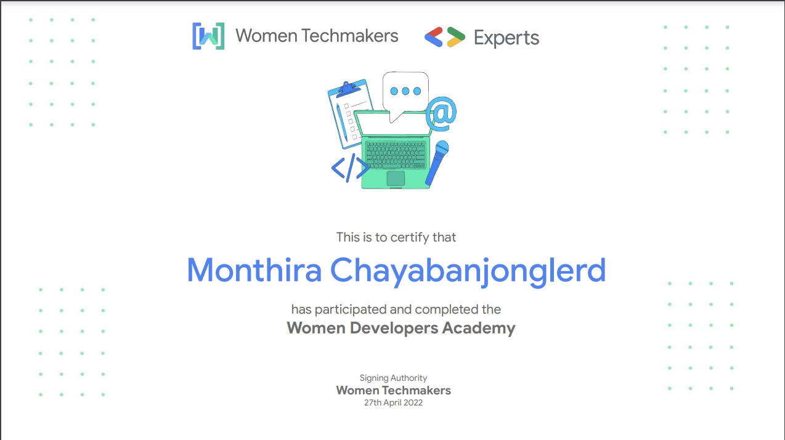
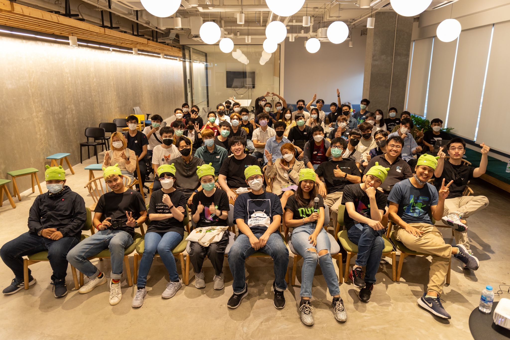
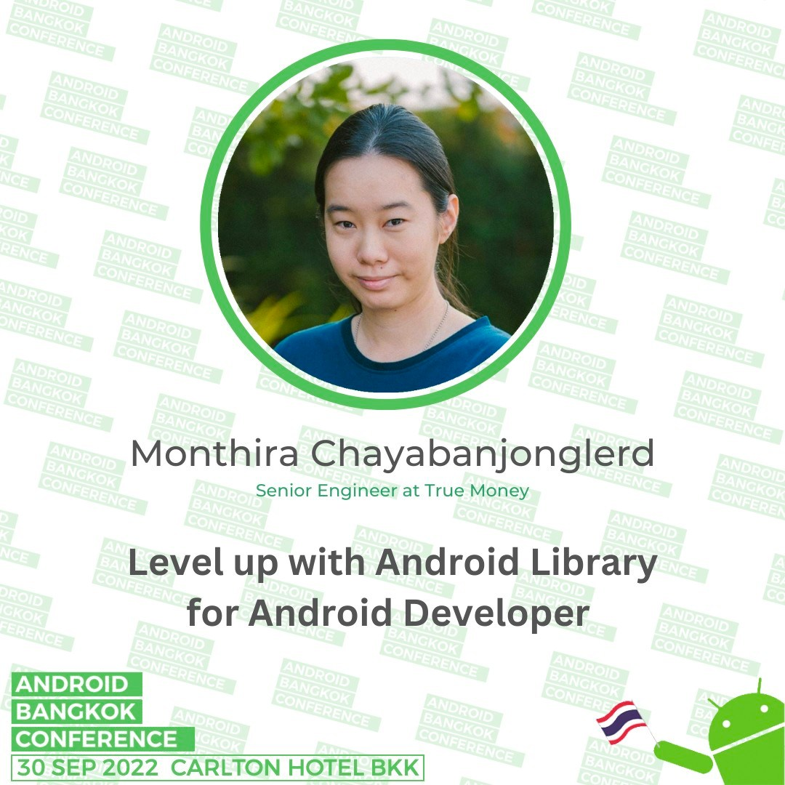
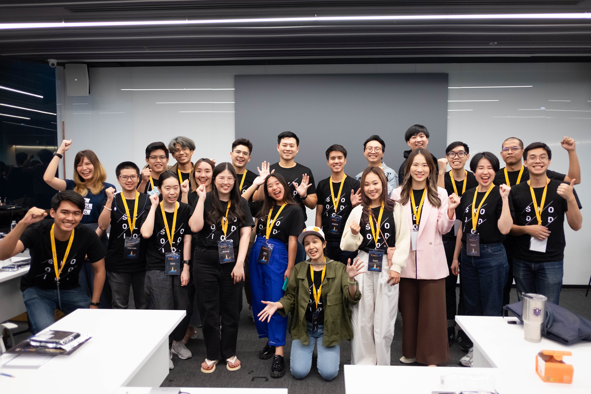
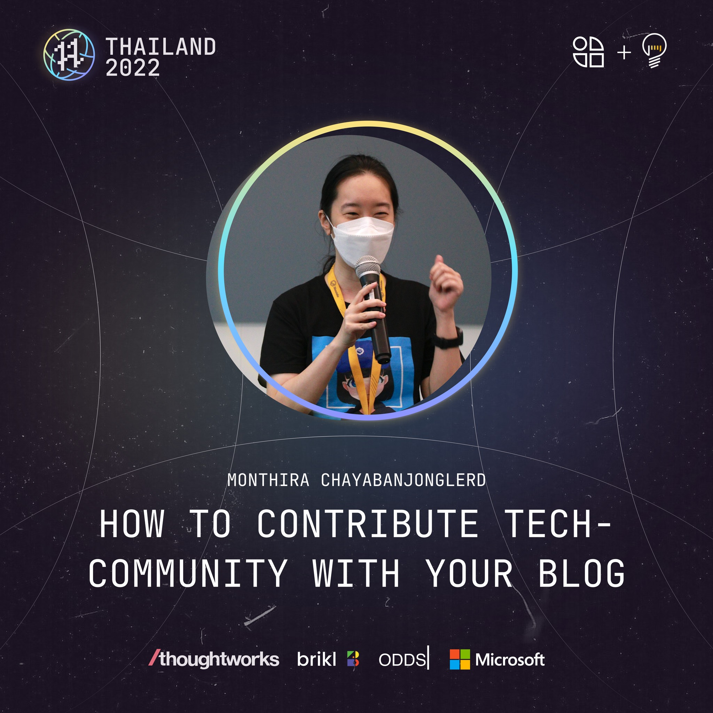
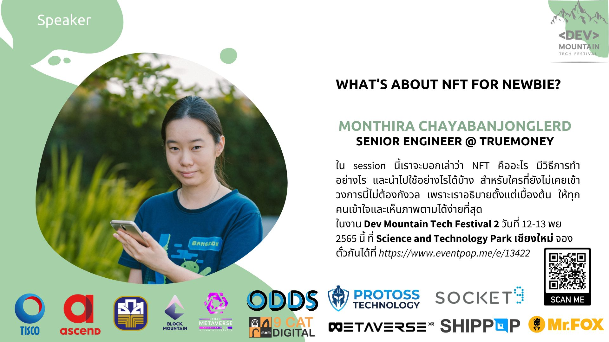

# 🗓 2022

👩‍💼 **Current**
- Senior Engineer @ TrueMoney
- Content Creator @ MikkiPastel
- Modulator @ Stocker DAO (Discord)

📊 **Stat**
- 42 blogs (+ 2 medium blogs)
- 3 public speakers

⚠️ *not finish for update about my work*

---

## January

#### 📖 Blog
- [วิธีการ redirect domain จาก blogger ไปยัง ghost cms](https://www.mikkipastel.com/how-to-redirect-domain-from-blogger-to-ghost-cms/)
- [ทำ Jenkins pipeline ใน Android project ของเรากันเถอะ](https://www.mikkipastel.com/jenkins-pipeline-for-android-project/)
- [ทบทวน Python กับไลฟ์การทำ Wordle ของน้อง Mari Taiga](https://www.mikkipastel.com/live-python-wordle-mari-taiga/)
- [ทดลองทำ gitbook เป็นของตัวเอง](https://www.mikkipastel.com/how-to-create-my-gitbook/)

#### 🖥 Project
- **[mikkicoding](https://mikkicoding.mikkipastel.com/)**: Digital garden for tutorial content in Gitbook. This project is migrate from Owlvegrammo.

## February

#### 📖 Blog
- [ทดลองทำ React website แบบง่ายๆบน Vercel กันเถอะ](https://www.mikkipastel.com/simple-react-website-on-vercel/)
- [วิธีการรับเหรียญไว้เทสใน Ropsten Ethereum](https://www.mikkipastel.com/get-eth-and-token-for-test-with-ropsten-ethereum-testnet-by-faucet/)
- [แนะแนววิธีการทำ Github Profile ให้สวยงาม](https://www.mikkipastel.com/guide-for-do-github-profile-to-beautiful/)
- [จดประเด็นที่น่าสนใจใน "Web3.0 เว็บไร้ตัวกลางกำลังจะมา คนทำเว็บว่ายังไง"](https://www.mikkipastel.com/note-for-web-3-decentralized-web-webpresso/)

## March

#### 📖 Blog
- [ทำไมเราจึงห้ามให้ seed และ private key ของ wallet ของเราให้คนอื่น?](https://www.mikkipastel.com/why-dont-give-seed-and-private-key-to-other/)
- [สิ่งเตือนใจของดรอยเดฟ "อย่าปล่อยให้แอปเติบโตไปในทางที่ผิดจนสายเกินแก้"](https://www.mikkipastel.com/remain-for-android-developer-with-dont-accidentally-risk-being-distracted-until-its-too-late/)
- [วิเคราะห์เทรนคริปโตที่น่าจับตามองในปี 2022 ของคุณต้นฮ้อและเพจ Stocker Day](https://www.mikkipastel.com/crpytocurrency-trend-2022-by-tonhor-and-stocker-day/)
- [จดสรุป "NFT ตอนนี้ยังน่าเล่นอยู่ไหม ถึงขาลงแล้วหรือยัง ?"](https://www.mikkipastel.com/nft-is-still-to-invest-even-thought-downtrend-is-already/)
- [สรุป Lifelong Journey as a Software Engineer จากงาน Dev Mountain Tech Festival](https://www.mikkipastel.com/lifelong-journey-as-a-software-engineer-dev-mountain-tech-festival/)
- [สรุป session สาย blockchain แบบมัดรวม จากงาน Dev Mountain Tech Festival](https://www.mikkipastel.com/summary-all-session-blockchain-from-devmountainfestival/)

#### 🏕 Activity
- **Women Developers Academy SEA**: Participate to Exclusive Online Training Program and 1-1 Mentorship with Googler for 4 weeks.

## April

#### 📖 Blog
- [สรุป "Workshop: Hands-on Securing Smart Contract" จากงาน KBTG Inspire2](https://www.mikkipastel.com/summary-workshop-hands-on-securing-smart-contract-kbtg/)
- [ทำความรู้จัก Web 3.0 และ WASM เพิ่มเติมจากงาน "Bkk.js #14 Back in business"](https://www.mikkipastel.com/bkk-js-14-back-in-business/)
- [Next Level Discord Bot กับการแจ้งเตือนประชุมหลบวันหยุด กิจกรรมในทีม และวันลา](https://www.mikkipastel.com/next-level-discord-bot-with-google-calendar/)

## May

#### 📖 Blog
- [ทำเว็บ todo list แบบง่ายๆ โดยใช้ Svelte และ Tailwind CSS เป็นครั้งแรก](https://www.mikkipastel.com/todo-list-by-svelte-and-tailwind-css-first-time/)
- [ทำความรู้จักกับ GitHub Actions](https://www.mikkipastel.com/get-to-know-github-actions/)
- [บันทึกจากงาน Code in the Wind #1](https://www.mikkipastel.com/diary-of-code-in-the-wind-1/)
- [ฝึกการ bridge ไป Optimism เพื่อกิจกรรมล่า airdrop ในอนาคต](https://www.mikkipastel.com/bridge-eth-to-optimism-before-airdrop-event/)

#### Activity
- join [Code in the Wind #1](https://showdown.space/events/code-in-the-wind-1/)

## June

#### 📖 Blog
- [ทำความรู้จักกับ Rei Chain เชนน้องใหม่ของคนไทยกันเถอะ](https://www.mikkipastel.com/introduce-what-is-rei-chain/)
- [วิธีง่ายๆในการดู NFT ที่ได้ ในกระเป๋าของเรา](https://www.mikkipastel.com/how-to-see-my-nft-in-wallet-with-metamask-and-ipfs/)
- [จดสรุป Skooldio x Google Developers - What’s New in Android](https://www.mikkipastel.com/skooldio-x-google-developers-whats-new-in-android/)
- [เกมส์ Ni no Kuni: Cross Worlds เกี่ยวกับ Blockchain ยังไง](https://www.mikkipastel.com/ni-no-kuni-cross-worlds-blockchain-game-airdrop-event/)
- [เรียนปูพื้นฐานพร้อมสร้างเหรียญ ใน Discord Naga DAO](https://www.mikkipastel.com/smart-contract-classroom-discord-naga-dao/)
- [สรุป Svelte Meetup ครั้งแรกของประเทศไทยกันจ้า](https://www.mikkipastel.com/svelte-meetup-1-bangkok/)

## July

#### 📖 Blog
- [Key takeaway จากคอร์ส How to Become a Top Performer](https://www.mikkipastel.com/key-takeaway-from-how-to-become-a-top-performer-skooldio/)
- [ทำความรู้จัก NFT โปรเจกต์ใหญ่ของเรา "Next Journey" จ้า](https://www.mikkipastel.com/introduction-of-nft-mikkipastel-next-journey/)
- [เล่าเรื่องงาน Crypthon Challenge ของ Stocker DAO](https://www.mikkipastel.com/crypthon-challenge-stocker-dao/)

#### 👩‍💻 Work
- start Senior Engineer at TrueMoney. My job description is develop TrueMoney application for Android platform.
- Writer of [Ascend Developer](https://developers.ascendcorp.com/) medium publishion

## August

#### 📖 Blog
- [ทดลองทำ generative NFT แบบง่ายๆ แบบไม่ต้องโค้ดกัน บน speedboat](https://www.mikkipastel.com/try-to-do-geneative-nft-without-coding-by-speedboat/)

#### 👩‍🏫 Community
- [staff for Android Developer Meetup 08.2022](https://medium.com/android-developer-meetup-th/diary-of-staff-at-android-developer-meetup-08-2022-by-mikkipastel-b22d6f89b50)

## September

#### 📖 Blog
- [รีวิวคริปโทแสตมป์ สแตมป์ NFT ของทางไปรษณีย์ไทย](https://www.mikkipastel.com/review-crypto-stamp-nft-thailandpost/)
- [กลับมาอีกครั้งกับงาน LINE THAILAND DEVELOPER CONFERENCE 2022](https://www.mikkipastel.com/line-thailand-developer-conference-2022/)

#### 👩‍💻 Work
- Blog: [เขียนแอพแอนดรอยด์ตั้งแต่เริ่มต้น ตอนที่ 1 : Introduction with Android Project](https://developers.ascendcorp.com/basic-android-development-ep-1-introduction-with-android-project-fbf754bb4d3a)

#### 👩‍🏫 Community
- **Android Bangkok 2022**: I came back for speaker in Android Bangkok again with "Level up with Android Library for Android Developer" session

## October

#### 📖 Blog
- [สรุป Productive Communication & Personality Improvement จากโครงการ Skooldio Creator Square](https://www.mikkipastel.com/productive-communication-personality-improvement-skooldio-creator-square/)
- [ทดลองเป็น Creator ฝึกหัด กับเหล่า Skooldio Creator Square ที่ Creators Playground กันจ้า](https://www.mikkipastel.com/creators-playground-skooldio-creator-camp/)
- [สอนยังไงให้สนุก กับพี่ต้า แห่ง Skooldio กับ Effective and Creative](https://www.mikkipastel.com/effective-and-creative-skooldio-creator-square/)
- [มาเพิ่ม Skill ของ Android Developer ด้วยการทำ Android Library กันเถอะ](https://www.mikkipastel.com/level-up-with-android-library-for-android-developer-android-bangkok-2022/)
- [ทำเพจหลักแสน ทำกี่รอบก็ทำได้ โดยพี่เทอร์โบ เพจ Bittoon](https://www.mikkipastel.com/how-to-get-100000-follower-in-facebook-page-by-turbo-bittoon-dao/)
- [งานชาว open source เป็นยังไงบ้างนะ? กับงาน Hacktoberfest Thailand 2022](https://www.mikkipastel.com/hacktoberfest-thailand-2022/)

#### 👩‍🏫 Community
- **Skooldio Creator Square**: program for tech content creator to contribute tech community

- **[Hacktoberfest Thailand 2022](https://www.youtube.com/watch?v=8aVdlBhY6zU)**: Send call to paper to contribute with my session "How to contribute tech community with your blog" for this event.

## November

#### 📖 Blog
- [5 สิ่งแตกต่าง ที่ Kotlin ดีกว่า Java (ของดีครับน้อนๆ)](https://www.mikkipastel.com/5-difference-things-kotlin-is-great-than-java/)
- [บันทึกเกี่ยวกับงาน Dev Mountain Tech Festival ครั้งที่ 2 ที่เชียงใหม่](https://www.mikkipastel.com/dev-mountain-tech-festival-2-chiang-mai/)
- [5 สิ่งแตกต่าง ที่ Kotlin มีแต่ Java ไม่มี](https://www.mikkipastel.com/5-difference-things-kotlin-have-but-java-not-have/)

#### 👩‍💻 Work
- Editor of Ascend Developer medium publishion

#### 👩‍🏫 Community
- **[Dev Mountain Tech Festival 2](https://www.youtube.com/watch?v=-3Ur6Kwg65A)**: This is my first time for public speaking in chiang mai and my session is "What’s about NFT for newbie" to talk about my research about How to do my NFT collection.

## December 

#### 📖 Blog
- [5 สิ่งแตกต่าง ที่ Kotlin มีแต่ Java ไม่มี](https://www.mikkipastel.com/5-difference-things-kotlin-have-but-java-not-have/)
- [เรียน "มือใหม่ทํา [กราฟิก] อย่างไรให้.. ปัง!" จาก BitToonDAO Learning](https://www.mikkipastel.com/how-to-do-graphic-from-newbie-bittoon-dao-learning/)

#### 👩‍🏫 Community
- coming soon